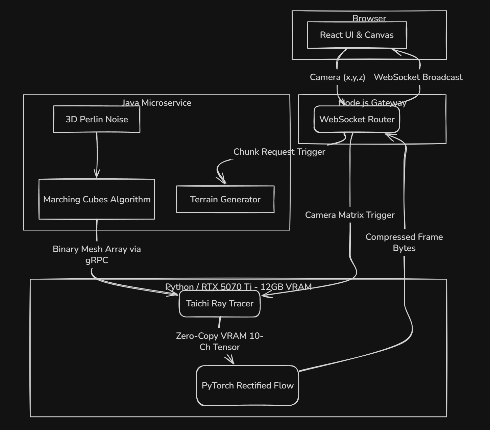

# Project Albedo: System Architecture

The following document outlines the end-to-end architecture for the real-time neural rendering pipeline. The system is designed as a hybrid edge-cloud monorepo, where lightweight WebSockets bridge a React client to a heavy, GPU-bound Python inference engine.

---

## High-Level Architecture Diagram

The system operates across three primary domains: the Client (Browser), the Transport Node (Server), and the GPU Inference Engine (Backend).



---

## Directory Structure

```bash
albedo/
├── app/
│   ├── client/                  # React + Vite frontend
│   ├── gateway/                 # Node.js WebSocket router
│   └── engine/                # Backend Microservices
│       ├── java_terrain/        # (NEW) Java Marching Cubes Engine
│       │   ├── src/main/java/   
│       │   └── pom.xml          # Maven config
│       └── python_render/       # Taichi + PyTorch Engine
│           ├── brain/           
│           ├── tracer/          
│           ├── main.py          
│           └── pyproject.toml   
├── docs/                        
├── .gitignore
└── README.md
```

---

## Component Data Contracts

---

### A. The Client & Gateway (app/client/ & app/gateway/)

- **Role**: Input capture and frame painting. Node.js acts as the traffic cop.

- **Payload In**: Client sends camera coordinates (x, y, z) over WebSockets.

- **Routing**: Node.js splits this signal. It sends the exact camera matrix to Python for rendering, and sends a "Chunk ID" (based on spatial hashing of the x,y,z coordinates) to the Java engine.

---

### B. The Java Terrain Engine (app/services/java_terrain/)

- **Role**: Procedural geometry generation. This fully utilizes the host machine's multi-core CPU.

- **Execution**:

  1. Calculates 3D Perlin or Simplex noise to determine terrain density.

  2. Runs the Marching Cubes algorithm to convert density fields into exact vertices and triangle indices.

- **The Hand-off (gRPC)**: Serializes the massive arrays of floats (Vertices) and integers (Indices) using Protocol Buffers and streams them over a local gRPC channel to the Python engine.

---

### C. The Python GPU Engine (app/services/python_render/)

- **Role**: Ray tracing, AI denoising, and VRAM management.

- **Execution (Taichi)**:

  1. Receives the binary mesh from Java via gRPC.

  2. Dynamically rebuilds the Bounding Volume Hierarchy (BVH) in CUDA memory.

  3. Uses the Node.js camera matrix to shoot 1-SPP rays.

  4. Outputs the 10-channel G-buffer tensor directly to VRAM.

- **Execution (PyTorch)**:

  1. Reads the VRAM tensor (Zero-Copy).

  2. Solves the Rectified Flow ODE in 1 Euler step.

  3. Compresses the output RGB tensor to WebP/JPEG bytes and streams it to the Node.js gateway.

---

## Bottlenecks & Optimizations

- **gRPC Serialization Overhead**: Converting Java primitives to Protobuf and parsing them back in Python can incur latency. Solution: Send data in flat, 1D byte-arrays to avoid object-parsing overhead.

- **Dynamic BVH Rebuilds**: Taichi will need to rebuild the BVH every time Java sends a new terrain chunk. If the BVH build takes longer than 16ms, the frame rate will drop. Solution: Implement a dual-buffer BVH or localized BVH updates so the engine can keep rendering the old chunk while compiling the new one in the background.

- **VRAM Limits**: Procedural worlds can consume infinite memory. Python must aggressively garbage-collect old geometry chunks as the user moves away from them to stay under the 12GB limit of the 5070 Ti.
